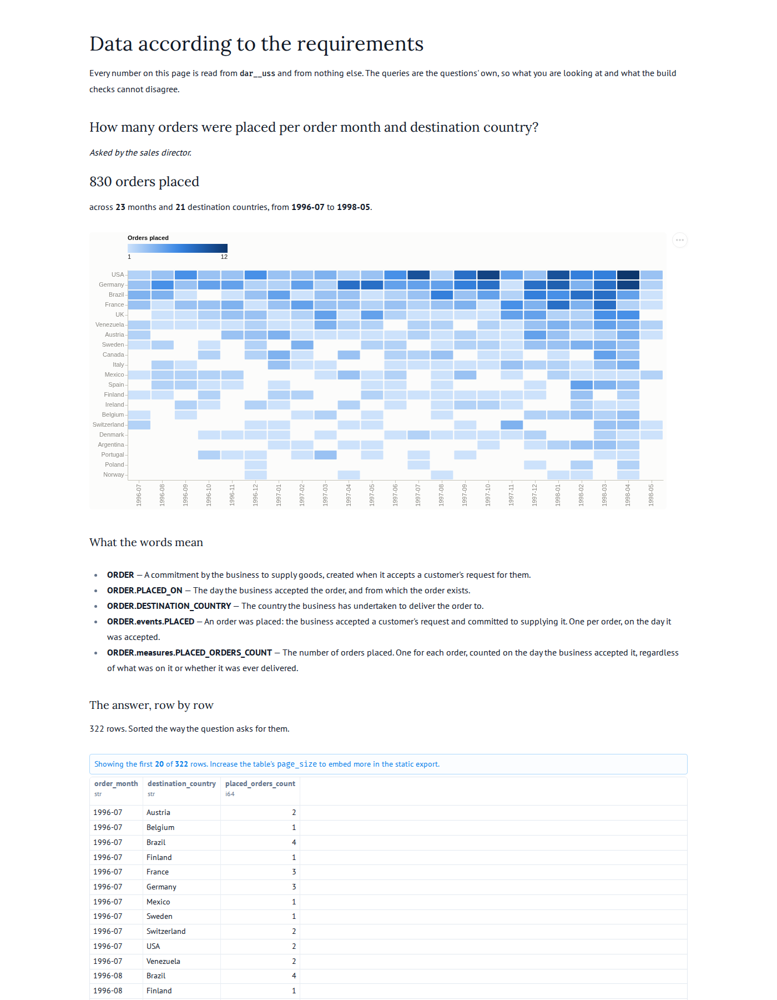

## Story

As the **sales director**, I want to see how many orders were placed per order month and
destination country, so that I can put sales effort where demand is moving.

## Definitions

Every term below is defined in `dab/model.yaml` or `dab/uss.yaml` and nowhere else. This
question references them; it does not restate them.

- {{ORDER}}
- {{ORDER.PLACED_ON}}
- {{ORDER.DESTINATION_COUNTRY}}
- {{ORDER.events.PLACED}}
- {{ORDER.measures.PLACED_ORDERS_COUNT}}

## The W's

- **Why**: demand moves between countries and between seasons, and sales effort should
  follow it rather than lag it by a year.
- **What**: the count of orders placed. Not their value, not their contents, not whether
  they were ever delivered.
- **Who**: customers place them; the sales director is the one who acts on the answer.
- **How**: one `placed` event per order, counted at the month of the day it was placed.
- **Where**: the country the order is to be delivered to, which is not necessarily where
  the customer is.
- **When**: all history, at calendar month (`_calendar.month_label`, `YYYY-MM`).
- **What will you do with it**: move sales effort toward the countries whose monthly counts
  are rising, and ask why for the ones that are falling.

## Nulls

Both dimensions are nullable in the source metadata, and neither is null in the recording.

Both queries nonetheless take the same position, for the same stated reason rather than by
coincidence: an order with no date on which it was placed has no `placed` event, by
construction in the generated layer, and the control query mirrors that with
`WHERE o.order_date IS NOT NULL`. A null destination country would be kept as its own group
by both — the generator never invents a member, and the control does not either.

## Delivered

The presentation this question was accepted on, as it stood at that commit. The blueprint
asks that what was delivered and when is recorded; the picture beside the question is that
record, and it is why a later reader can tell whether the answer they are looking at now is
the one somebody acted on.

## Answers

Two queries, in `staged.sql` and `uss.sql`. The first computes the answer straight from what
the source sent, bypassing the business model and the star schema entirely. The second
computes it from the star schema. They must agree row for row.

That check does not prove the answer is *right* -- a wrong definition would make both wrong
together. It proves that routing the number through integration and generation did not
change it, which is the failure this architecture is most exposed to and least able to see.
