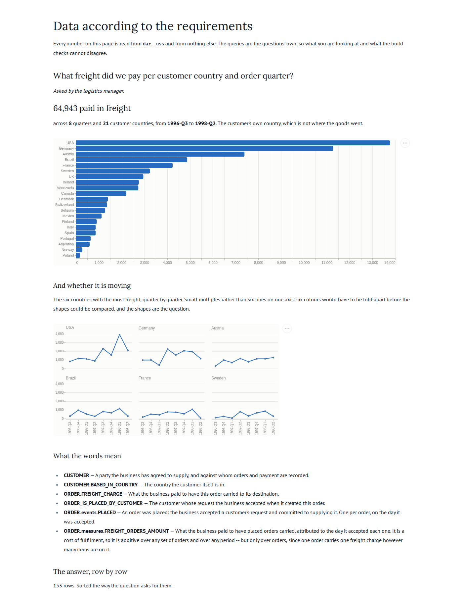

## Story

As the **logistics manager**, I want to see what freight we paid per customer country and
order quarter, so that I can tell where carriage is eating the margin and negotiate against
a number rather than an impression.

## Definitions

Every term below is defined in `dab/model.yaml` or `dab/uss.yaml` and nowhere else. This
question references them; it does not restate them.

- {{CUSTOMER}}
- {{CUSTOMER.BASED_IN_COUNTRY}}
- {{ORDER.FREIGHT_CHARGE}}
- {{ORDER_IS_PLACED_BY_CUSTOMER}}
- {{ORDER.events.PLACED}}
- {{ORDER.measures.FREIGHT_ORDERS_AMOUNT}}

## The W's

- **Why**: freight is a cost of fulfilment that nobody negotiates until they can see where it
  concentrates. A quarterly figure per country is small enough to act on and long enough not
  to be noise.
- **What**: the freight charge on orders, summed. Not what anyone was billed, not a rate per
  kilo, not a count of shipments.
- **Who**: the customer the order was placed by — **not** whoever the goods were sent to.
- **How**: one `placed` event per order carries one freight charge, attributed to the day the
  business accepted the order.
- **Where**: the country the *customer* is based in, reached by inheriting the customer's key
  onto the order's row. This is the first question in this system whose dimension lives on a
  different entity from its measure.
- **When**: all history, at calendar quarter (`_calendar.quarter_label`, `YYYY-Qn`).
- **What will you do with it**: take the two or three countries with the largest quarterly
  freight to the carrier, and check whether the ones that are growing are growing in orders
  too or only in cost.

## Nulls

An order with no customer would group under a null country rather than being dropped: both
queries join **left**, so the total here is all the freight the business paid, and a reader
can add the column up and recognise the number. No order in the recording is in that
position, and no customer is missing a country, so the choice is presently invisible — it is
stated because a later load could make it visible without warning, and because the generated
layer already keeps such a row by construction. Nulls are not given an invented member.

## What this question does not prove

The two queries agree, and here that proves less than it usually does.

The dimension is the customer's country, and the obvious wrong implementation is the order's
destination country — the value already sitting on the same row, one join cheaper. **In this
recording those two columns are equal on every one of the 830 orders.** So an implementation
that inherited nothing and read `DESTINATION_COUNTRY` instead would produce this same answer,
and the agreement check would pass.

That is not a reason to weaken the claim; it is a reason to say what carries it instead. Three
generated data checks assert the inheritance itself rather than the number it produces: that
no order has two customers at one instant, that the edge loaded any pairs at all, and that
every inherited key names a row in the customer peripheral. Those hold regardless of whether
the two country columns happen to coincide.

The number is checked here. The mechanism is checked there. Neither alone would have been
enough for this particular question, and it took looking at the data to find that out.

## Delivered

## Answers

Two queries, in `staged.sql` and `uss.sql`. The first computes the answer straight from what
the source sent, bypassing the business model and the star schema entirely. The second
computes it from the star schema. They must agree row for row — 153 rows, totalling the same
64,942.69 the source holds.
