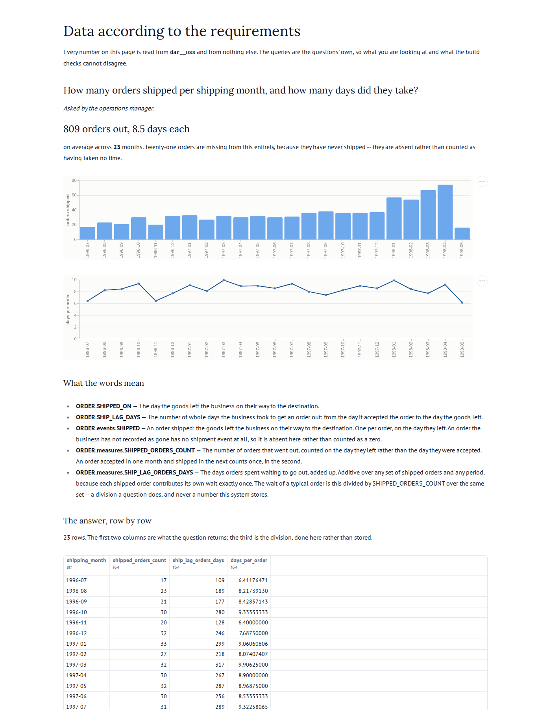

## Story

As the **operations manager**, I want to see how many orders went out each month and how long
they waited, so that I can tell whether a busy month is also a slow one — and staff against the
answer rather than against a feeling.

## Definitions

Every term below is defined in `dab/model.yaml` or `dab/uss.yaml` and nowhere else. This
question references them; it does not restate them.

- {{ORDER.SHIPPED_ON}}
- {{ORDER.SHIP_LAG_DAYS}}
- {{ORDER.events.SHIPPED}}
- {{ORDER.measures.SHIPPED_ORDERS_COUNT}}
- {{ORDER.measures.SHIP_LAG_ORDERS_DAYS}}

## The W's

- **Why**: throughput and speed move together or they do not, and which of the two it is
  decides whether the answer is more people or a different process. One number cannot say.
- **What**: two additive measures — the count of orders that went out, and the days they spent
  waiting, added up. Not an average: see below.
- **Who**: the operations manager acts on it; the business ships.
- **How**: one `shipped` event per order, on the day the goods left. **An order that has not
  shipped has no shipment event at all**, so it is absent rather than counted as a zero-day
  order — which would make the slowest orders look like the fastest. 21 of 830 orders are in
  that position.
- **Where**: not asked. This is a question about time, and adding a geography to it would be
  a different question.
- **When**: all history, by the month the goods **left** (`_calendar.month_label`, `YYYY-MM`).
  An order accepted in one month and shipped in the next belongs to the second.
- **What will you do with it**: compare the two lines. A month where the count rises and the
  wait rises with it is a capacity problem; a month where the wait rises on its own is not.

## Why the answer has no average in it

The question asks how many days orders took, and the answer does not contain that number.

Conventions §2: *"Ratios are not stored. Store numerator and denominator as additive measures
and divide at query time."* Its worked example is this question — `avg_days_to_ship` becomes
`ship_lag_orders_days`, and the average is `sum(ship_lag_orders_days) / sum(shipped_orders_count)`.
An average of averages is wrong at every grain but the one it was computed at, so a stored
monthly average could not be re-summed into a quarter. Two additive measures can.

There is a second reason, found by measuring rather than by reading. The acceptance check
compares the two answers **row by row as values**, which is exact only while every value is
exact. A ratio is a `DOUBLE` however it is reached. Both queries agree today because both
reduce to one division of two exact integer sums — but float addition is not associative and
DuckDB imposes no order on `sum`: `[0.1, 0.2, 0.3]` sums to `0.6000000000000001` and the same
three reversed to `0.6`. So the first float-valued measure would let the two queries disagree
by a bit, on some machines, some of the time. Keeping the division out of the stored answer
keeps this check exact by construction rather than by luck.

The page does the division, once, where a reader can see it.

## Nulls

`shipped_date` is null on 21 orders and that is the whole point of this slice: those orders have
no row in the `shipped` stage, by construction rather than by a filter anyone has to remember.
The control query mirrors it with `WHERE o.shipped_date IS NOT NULL`.

No order in the recording ships before it was accepted, and none has a null order date, so no
lag is negative and none is missing on a shipped order. Both queries would carry a null lag
through `sum`, which skips it — so a shipped order with no accepted date would be counted and
not waited-for, in both answers alike.

## Delivered

## Answers

Two queries, in `staged.sql` and `uss.sql`. The first computes the answer straight from what
the source sent, bypassing the business model and the star schema entirely. The second computes
it from the star schema. They must agree row for row — 23 months, 809 orders, 6,870 days.
