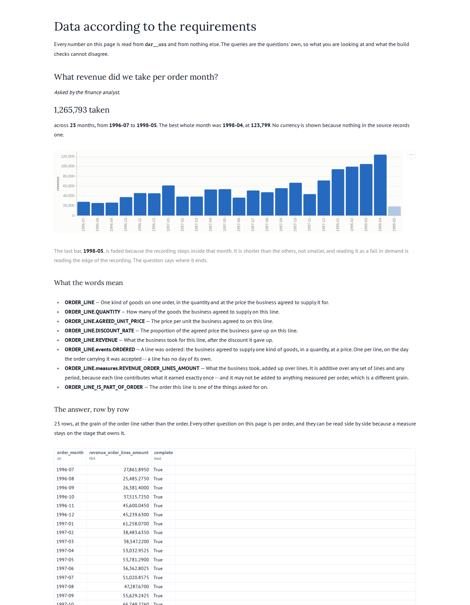

## Story

As the **finance analyst**, I want to see what the business took each month, so that I can put a
revenue line beside the order counts and the freight the other three questions already give me —
and say whether a busy month was a valuable one.

## Definitions

Every term below is defined in `dab/model.yaml` or `dab/uss.yaml` and nowhere else. This
question references them; it does not restate them.

- {{ORDER_LINE}}
- {{ORDER_LINE.QUANTITY}}
- {{ORDER_LINE.AGREED_UNIT_PRICE}}
- {{ORDER_LINE.DISCOUNT_RATE}}
- {{ORDER_LINE.REVENUE}}
- {{ORDER_LINE.events.ORDERED}}
- {{ORDER_LINE.measures.REVENUE_ORDER_LINES_AMOUNT}}
- {{ORDER_LINE_IS_PART_OF_ORDER}}

## The W's

- **Why**: three questions have counted orders and what it cost to move them. None says what any
  of it was worth, so nothing here can tell an expensive month from a valuable one.
- **What**: one additive measure — what the business took, added up over lines. Not what it
  collected: nothing in this source records a payment.
- **Who**: the finance analyst acts on it; the business is what earns it.
- **How**: one `ordered` event per line, on the day the order carrying it was accepted. A line
  has no day of its own, so it inherits the order's, along the same edge and at the same instant
  as the key ([ADR 0009](../../adr/0009-a-stage-may-be-dated-by-a-date-it-inherits.md)).
- **Where**: not asked. Geography belongs to questions 1 and 2; adding it here would ask a third
  thing at the same time as the two new ones this slice already introduces.
- **When**: all history, by the month the order was **accepted** (`_calendar.month_label`,
  `YYYY-MM`) — 23 months, the same 23 the first question spans. Revenue is attributed to the day
  demand arrived, not the day goods left: that is a different question and would need the
  shipment event.
- **What will you do with it**: read it beside q01. A month whose orders rose and whose revenue
  did not is a month of smaller orders, and that is a different problem from a quiet month.

## What this slice is actually for

The question is the smallest one that needs a second grain, and the second grain is the point.

Every entity until now was one row per order. A measure could not multiply however the join was
written, so [D-0001](../../deviations.md) — one shared `dar__uss` for every process — has been
carried on an argument nobody could test. Now there are 2,155 lines against 830 orders, between
one and twenty-five to an order.

The freight number is the one to watch. It sits on the order, it is real, and it is in the same
bridge as this measure:

| | rows | freight | revenue |
|---|---|---|---|
| the whole bridge, no filter | 3,794 | **64,942.69** | **1,265,793.0395** |
| per order month, joined to `_calendar` | 3,794 | **64,942.69** | **1,265,793.0395** |

2,155 line rows carry `order_key`, and freight does not move. That is the property, measured.

## The half of it that is false

The measure is protected. The **attribute it was made from is not**, and it is published beside
it on the order peripheral:

```sql
SELECT sum(o.freight_charge)
FROM dar__uss._bridge AS b
INNER JOIN dar__uss."order" AS o ON b.order_key = o.order_key
WHERE b._event = 'ordered';
-- 207,306.10 against a true 64,942.69. Once per line.
```

That is one join and one sum — the same join this question's answer writes. It was already
wrong before this slice, at 128,897.71, because the order already had two events;
[ADR 0012](../../adr/0012-the-bridge-protects-measures-and-not-the-attributes-beside-them.md)
decides what to do about it, and the short version is that a published answer may not aggregate a
peripheral's column at all, enforced on the engine's own parse tree. This question obeys that
rule, and so does every question before it.

## Nulls

None. Every line has a quantity, a price and a discount; no quantity is zero or negative, no
price is negative, and no discount is outside 0 to 1. 838 of the 2,155 lines carry a discount.

Every line belongs to an order that exists, and every order has at least one line — so nothing is
dropped by either query's join, and the two agree for the reason they should rather than by both
dropping the same rows. Were a line's order missing, it would have no bridge row at all, because
an inherited date that does not resolve produces no row; the control mirrors that with an inner
join rather than by filtering afterwards.

## The composed key

A line has no identifier on the order form. Its key is composed from the order and the product,
and that composition is checked against the two source columns on every build rather than argued
about: 2,155 lines, 2,155 distinct composed keys
([ADR 0010](../../adr/0010-a-composite-source-key-becomes-one-key-and-is-checked-against-its-parts.md)).

## Delivered



## Answers

Two queries, in `staged.sql` and `uss.sql`. The first computes the answer straight from what the
source sent, bypassing the business model and the star schema entirely. The second computes it
from the star schema. They must agree row for row — 23 months, 2,155 lines, 1,265,793.0395.
