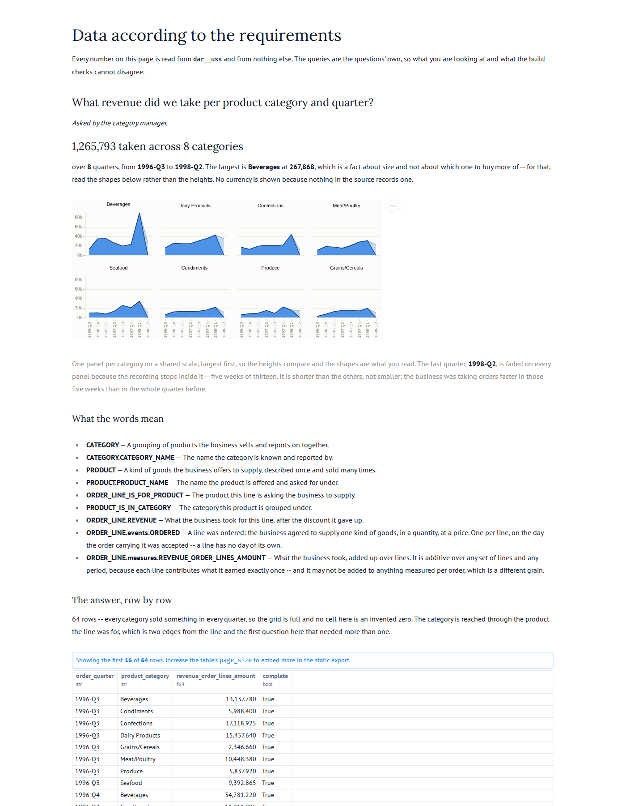

## Story

As the **category manager**, I want to see what each category took quarter by quarter, so that I
can tell a category that is growing from one that is merely large — and put buying effort behind
the first rather than the second.

## Definitions

Every term below is defined in `dab/model.yaml` or `dab/uss.yaml` and nowhere else. This
question references them; it does not restate them.

- {{CATEGORY}}
- {{CATEGORY.CATEGORY_NAME}}
- {{PRODUCT}}
- {{PRODUCT.PRODUCT_NAME}}
- {{ORDER_LINE_IS_FOR_PRODUCT}}
- {{PRODUCT_IS_IN_CATEGORY}}
- {{ORDER_LINE.REVENUE}}
- {{ORDER_LINE.events.ORDERED}}
- {{ORDER_LINE.measures.REVENUE_ORDER_LINES_AMOUNT}}

## The W's

- **Why**: q04 says what the business took each month. It does not say what it took it *on*, so
  nothing so far can tell a category worth buying more of from one that is simply big.
- **What**: one additive measure, the same one q04 uses, cut a different way. Nothing new is
  measured here; what is new is the dimension it can be cut by.
- **Who**: the category manager acts on it; the business is what earns it.
- **How**: through **two edges**. A line is for a product, and a product is in a category. Nothing
  on an order names a category, and nothing in the source relates a line to one directly — so this
  is the first question here whose answer cannot be reached in a single hop.
  ([ADR 0014](../../adr/0014-a-stage-carries-the-key-of-everything-it-reaches-at-any-depth.md).)
- **Where**: not asked. Geography belongs to questions 1 and 2.
- **When**: all history, by the quarter the order was **accepted** — 8 quarters, 1996-Q3 to
  1998-Q2, and the last of them is partial. Quarters rather than months because a category's
  trend is what is being read, and 8 categories × 23 months is a grid nobody reads.
- **What will you do with it**: compare shapes, not sizes. Beverages is the largest category and
  Grains/Cereals the smallest, and that says nothing about which to buy more of; the question is
  which line is climbing.

## What this slice is actually for

The chain, and the fact that it was never walked.

The generator asked "what does this stage reach?" in five places and every one of them asked for
the edges out of one entity and stopped. So there was no walk, and an entity two edges away got no
key column and no peripheral at all.

**That was not new to this slice.** `ORDER_LINE → ORDER → CUSTOMER` has been declared since slice
4, and on the warehouse as shipped every one of 2,155 line rows carried a null customer key.
Grouping line revenue by customer country returned a single row — the right total, no dimension,
every check green. Slice 5 does not introduce the hole; it is the first question that could not be
answered without noticing it.

| | before | after |
|---|---|---|
| `ordered` rows carrying `customer_key` | 0 | 2155 |
| `ordered` rows carrying `category_key` | — | 2155 |
| revenue total | 1,265,793.0395 | **1,265,793.0395** |
| freight total | 64,942.69 | **64,942.69** |

The last two lines are the ones that matter. A longer walk that moved a total would be the fan
trap arriving by the back door, and neither total moved.

## The edge we had not looked at yet

There is a second decision here and it is the one that would have shipped broken.

Built from a clean clone, every category key resolves. Built on a lake that had run before, **not
one of the 2,155 did** — while the same build resolved the product on every one of them. The
line's edge to its product was landed by the ingest that landed the lines; the product's edge to
its category was first landed ninety minutes later; and the lines had not changed, so the history
correctly held no newer version of them. A pair first observed later is not in force at an earlier
time.

CI checks out a clean tree, so CI would have been green and any deployment that had run before
would have lost the dimension in silence.

[ADR 0015](../../adr/0015-an-edge-first-seen-later-is-not-evidence-that-it-was-different-before.md)
settles it: these timestamps record when this system *looked*, not when a fact became true — the
source has no modified column anywhere, which is the whole reason history is dated by observation.
An edge with nothing preceding the row that inherits it resolves from the earliest version ever
observed. It fires only where we had not yet looked; a later correction is still not applied
retroactively.

## Where the series stops

The recording ends on **1998-05-06**, so the last quarter is five weeks of a thirteen-week one: 88
orders against 182 in the quarter before it. Drawn beside seven whole quarters, every category's
line falls off a cliff at the same point, and none of them did.

It is not a slowdown. 88 orders in 36 days is a faster rate than 182 in 90, so the business was
still growing when the recording stopped — which is exactly the reading a reader would get wrong.
The page fades that quarter on every panel and says so beneath them.

The first quarter is very nearly whole: the recording opens on 1996-07-04, four days into it.

## Nulls

None to speak of, and that is worth stating rather than assuming. All 77 products carry a
category. Every one of the 2,155 lines names a product that exists. Every category sold something
in every quarter — the grid is 8 by 8 with all 64 cells populated — so nothing here is hidden by
an empty cell, and the chart needs no invented zero.

Eight of the 77 products are discontinued and they still appear on past lines, which is right: the
business took the money, and withdrawing a product does not unmake the order.

## Delivered

## Answers

Two queries, in `staged.sql` and `uss.sql`. The first computes the answer straight from what the
source sent, walking line to product to category **by hand** in three joins, because the source
has no notion of a chain. The second reads the star schema, where the walk has already happened
and one join reaches the category. That difference is the point: they must agree row for row — 64
rows, 8 quarters, 8 categories, 1,265,793.0395.
